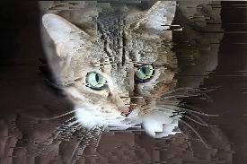

# Pixel Sorter: User Guide

## Introduction

Welcome to **Pixel Sorter**, an image processing application designed to create visual effects by sorting pixels based on brightness, edge detection, or thresholded image mask. Pixel sorting is a creative technique often used in digital art to produce abstract and glitch-like visuals. This application provides an intuitive interface for experimenting with pixel sorting, allowing users to customize sorting parameters and preview results in real-time.

### Features

- **Threshold Mask Sorting**: Sort pixels based on brightness thresholds.
- **Edge Detection Sorting**: Sort pixels based on detected edges.
- **Customizable Sorting Pipeline**: Add, remove, or disable sorting steps.
- **Save and Load Configurations**: Save sorting parameters for reuse.
- **Gallery**: View previously processed images.

---

## User Interface Overview

The application consists of three main pages:

1. **Upload Page**: Upload an image to start pixel sorting.
2. **Pixel Sorting Page**: Customize sorting parameters and preview results.
3. **Gallery Page**: View previously processed images.

### Key Components

- **Top Bar**: Navigate between the Pixel Sorting and Gallery pages.
- **Controls Panel**: Adjust sorting parameters, thresholds, and pipeline steps.
- **Canvas Previews**: View the original image, threshold mask, edge map, and sorted result.

---

## How to Create Nice Results in No Time

Follow these steps to create visually appealing results quickly:

### Step 1: Upload an Image

1. Navigate to the **Upload Page**.
2. Drag and drop an image into the dashed box or click to select a file.
3. Supported formats: `.png`, `.jpg`, `.jpeg`.

### Step 2: Customize Sorting Parameters

1. On the **Pixel Sorting Page**, choose a sorting mode:
   - **Threshold Mask**: Sort pixels based on brightness thresholds.
   - **Edge Detection**: Sort pixels based on detected edges.
2. Adjust thresholds:
   - For **Threshold Mask**, set the global brightness threshold.
   - For **Edge Detection**, set the low and high thresholds to control edge sensitivity.
3. Add sorting steps:
   - Click **Add Step** to add a new sorting step.
   - Customize the direction (rows, columns, diagonal) and order (ascending, descending).
   - Disable steps to experiment with different configurations.

### Step 3: Preview and Sort

1. Use the **Threshold Mask Preview** or **Edge Map Preview** to visualize intermediate results.
2. Click **Sort Pixels** to apply the sorting pipeline. Image is automatically re-sorted when changing parameters. In case sorting for some reason stopped working please reload the page.

### Step 4: Save Your Work

1. Click **Save Image** to export the sorted image in `.png` format.
2. Save the sorting configuration using **Save Configuration** to reuse parameters later.

---

## Exemplary Results

Here are some examples of what you can achieve with Pixel Sorter:

### Example 1: Cat image

- **Sorting Mode**: Edge detection.
  - Sorting Pipeline: Rows (Ascending).

### Example 2: Lenna

- **Sorting Mode**: Edge Detection.
  - Sorting Pipeline: Rows (Ascending), Diagonal (Ascending).

### Example 3: Geometric Patterns

- **Sorting Mode**: Edge Detection.
  - Sorting Pipeline: Columns (Descending), Rows (Descending).

---

## Tips and Tricks

1. **Experiment with Thresholds**:

   - Adjust thresholds to control the intensity of sorting effects.
   - Lower thresholds create subtle effects, while higher thresholds produce bold visuals.

2. **Disable Steps**:

   - Temporarily disable steps to see how the image looks without them.

3. **Use Edge Detection**:

   - Edge detection is ideal for creating more unique, abstract visuals.

4. **Save Configurations**:
   - Save your sorting parameters to quickly recreate effects on different images.

---

## Conclusion

Pixel Sorter is a powerful tool for creating unique and artistic visuals. Whether you're a digital artist or just exploring creative image processing, this application provides the flexibility and tools to bring your ideas to life. Experiment with different parameters, preview results, and save your configurations to achieve stunning effects effortlessly.

Enjoy creating with **Pixel Sorter**!
